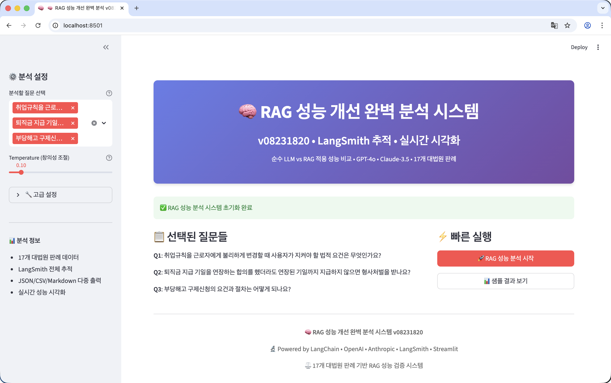
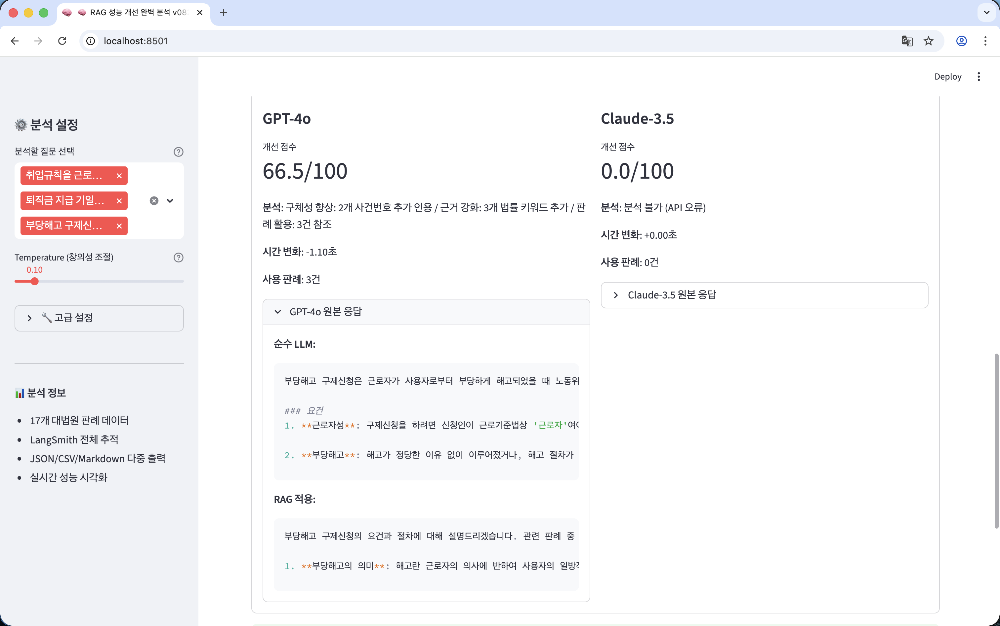
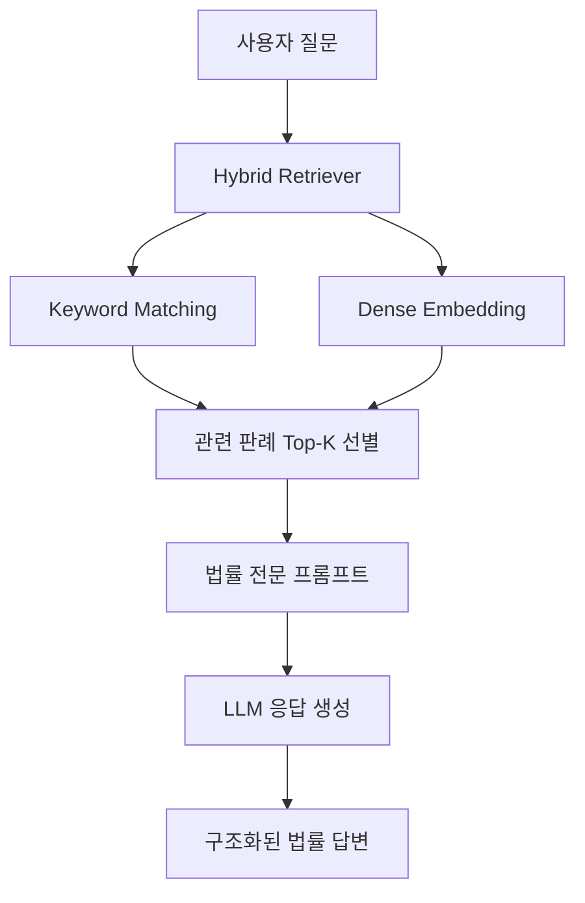

<div align="center">

<br>
<br>

# ⚖️ Legal RAG System

**LangChain 기반 대한민국 판례 질의응답 시스템**

  

<br>

# 🏅 Tech Stack 🏅


</div>

<br>

## 👥 Team

|  |  |  |  |  |
| :--: | :--: | :--: | :--: | :--: |
| [문국현](https://github.com/GH-Door) | [염창환](https://github.com/cat2oon) | [채병기](https://github.com/avatar196kc) | [김문수](https://github.com/ashrate) | [이상현](https://github.com/yourshlee) |
| 팀장 | 팀원 | 팀원 | 팀원 | 팀원 |

<br>

## Project Overview

| 항목 | 내용 |
|:-----|:-----|
| **📅 Date** | 2025.08 ~ 2025.09 |
| **👥 Type** | 팀 프로젝트 (Upstage AI Lab) |
| **🎯 Goal** | 법률 도메인 특화 RAG 파이프라인 구축 및 판례 기반 질의응답 시스템 개발 |
| **🔧 Tech Stack** | LangChain, LangSmith, FAISS, Hydra, Streamlit, Upstage Solar / OpenAI / Claude |
| **📊 Dataset** | [AI HUB 대법원 판례](https://www.aihub.or.kr/aihubdata/data/view.do?currMenu=115&topMenu=100&dataSetSn=71723) (17개 판례 JSON) |

<br>

## 📋 목차

- [프로젝트 소개](#-프로젝트-소개)
- [시스템 아키텍처](#-시스템-아키텍처)
- [문제 해결 과정](#-문제-해결-과정)
- [사용 예시](#-사용-예시)
- [프로젝트 구조](#-프로젝트-구조)

<br>

---

## 🎯 프로젝트 소개

**법률 텍스트**라는 고도의 전문성을 요구하는 도메인에서 LLM의 한계를 극복하기 위한 RAG 시스템입니다. 대한민국 대법원 판례를 기반으로 사용자의 법률 질문에 대해 **관련 판례와 법조항을 인용**하여 전문적인 답변을 제공합니다.

### 핵심 특징
- ⚖️ **도메인 특화**: 법률 분야에 최적화된 Prompt Engineering
- 🧩 **모듈러 아키텍처**: LLM, Retriever, Prompt 컴포넌트별 독립 교체 가능
- ⚙️ **설정 중심 설계**: Hydra를 통한 실험 친화적 구조
- 🤖 **멀티 LLM 지원**: Upstage Solar, OpenAI GPT, Claude 통합 지원
- 🔍 **Hybrid Retriever**: Keyword + Dense Embedding 결합 검색
- 💬 **Streamlit Demo**: 대화형 챗봇 인터페이스 제공

<br>

## 🏗️ 시스템 아키텍처



### LangChain LCEL Pipeline
```python
chain = (
    {"reference": retriever | RunnableLambda(law_docs_to_ref),
     "question": RunnablePassthrough()}
    | prompt.to_chain()
    | llm.chat_with()
    | StrOutputParser()
)
```

<br>

## 🔧 문제 해결 과정

### 1️⃣ 일반 RAG로는 법률 도메인 정확도 부족
> 복잡한 법률 용어와 판례 구조로 인해 기존 일반적인 RAG 접근 방식으로는 정확한 법률 정보 검색이 어려움. 유사 법률 개념 간 미묘한 차이를 구분하지 못하는 문제 발생

**해결:** 법률 전문 용어에 대해서는 **Keyword(BM25) 정확 매칭**을 우선, 복잡한 법률 개념과 상황적 맥락에 대해서는 **Dense Embedding 의미 유사도 검색**을 활용하는 **Hybrid Retriever** 전략 설계

---

### 2️⃣ 단순 키워드 매칭의 판례 인용 한계
> 키워드 빈도 기반 검색만으로는 정확한 판례 인용과 법리 해석을 제공하기 어려움

**해결:** 도메인 특화 **Prompt Engineering**을 통해 판례 인용 형식(판례번호 → 관련 법조항 → 법리 설명)과 법률 답변 구조를 최적화. 관련 판례가 없을 경우 명시적 종료 메커니즘으로 **Hallucination 방지**

---

### 3️⃣ 다양한 LLM/Retriever 조합 실험 관리
> 여러 LLM(Solar, GPT, Claude)과 Retriever(Keyword, Dense, Hybrid) 조합 실험 시 설정 관리가 복잡

**해결:** **Hydra/OmegaConf** 기반 설정 중심 설계로 YAML 파일 변경만으로 LLM/Retriever/Prompt 조합 전환 가능. **LangSmith** 통합으로 모든 실험 자동 추적 및 성능 비교

<br>

## 💬 사용 예시

### 입력 질문
```
"취업규칙을 근로자에게 불리하게 변경할 때 사용자가 지켜야 할 법적 요건은 무엇인가요?"
```

### 시스템 응답
```
참조 판례 번호: 2022다200249, 2022다226234, 2022다245419

관련 법 조항들: 근로기준법 제94조, 제95조, 제96조

취업규칙을 근로자에게 불리하게 변경할 때 사용자는 다음 요건을 준수해야 합니다:

1. 근로자 과반수의 동의 (근로기준법 제94조 제1항)
2. 변경 내용의 합리적 필요성 입증
3. 변경으로 인한 불이익의 정도가 수인한도 내
4. 변경에 따른 대상조치 제공
```

<br>

## 📁 프로젝트 구조

```
legal_langchain/
├── main.py                     # 메인 진입점 (Hydra 기반)
├── demo.py                     # Streamlit 챗봇 데모
├── conf/                       # 설정 파일
│   ├── config.yaml            # 메인 설정
│   ├── llm/                   # LLM 설정 (upstage, openai, anthropic, mock)
│   ├── retriever/             # 검색기 설정 (naive, dense, bm25, hybrid)
│   ├── embedder/              # 임베딩 설정 (Jina V3)
│   ├── dataset/               # 데이터셋 설정
│   ├── prompt/                # 프롬프트 설정
│   └── evaluation/            # 평가 설정 (LangSmith)
├── data/                       # 데이터
│   ├── law/                   # 대법원 판례 JSON (17건)
│   └── dummy/                 # 테스트용 더미 데이터
├── rag/                        # 핵심 컴포넌트
│   ├── datasets/              # 법률 문서 로더
│   ├── retriever/             # 검색 엔진 (naive, dense, bm25, hybrid)
│   ├── llms/                  # LLM 연동 (Upstage, OpenAI, Claude)
│   ├── embedder/              # 임베딩 모델 (Jina V3)
│   ├── prompts/               # 법률 QA 프롬프트 템플릿
│   ├── pipeline/              # RAG 파이프라인
│   ├── evaluation/            # 평가 메트릭
│   ├── history/               # 대화 히스토리 관리
│   ├── reference/             # 참조 문서 처리
│   ├── trace/                 # LangSmith 추적
│   └── utils/                 # 유틸리티
├── notebooks/                  # 분석 노트북
├── logs/                       # 실행 로그
└── pyproject.toml              # 프로젝트 설정
```

<br>

## 📝 License

This project is licensed under the MIT License.

---

<div align="center">

**⚖️ Legal RAG System**
*Powered by LangChain & Multi-LLM*

[](https://opensource.org/licenses/MIT)
[](https://www.python.org/downloads/)
[](https://python.langchain.com/)
[](https://upstage.ai/)

Made with ⚖️ by Legal RAG Team

</div>

---
